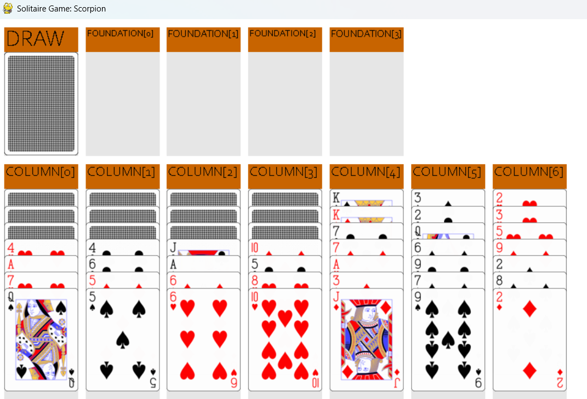

# Solitaire Rule Understanding

Large Language Models tend to perform poorly at understanding rules, whether applying them, interacting with them, generating or modifying them, or evaluating them. Fine-tuning on a specific ruleset helps, but it undermines one of the main advantages of a pre-trained model, its ability to generalize to rulesets it hasn't seen. This generalization is exactly what matters for using LLMs as a tool in game development, where they need to give feedback or suggest rule modifications on rulesets that don't resemble anything in their training data. This project asks whether fine-tuning on rule understanding can improve generalization to these unseen, out-of-distribution rulesets, rather than only improving performance on the rules it was trained on.

To study this, we needed a large space of distinct, well-defined rulesets to fine-tune and test on, so we built a framework for generating and simulating Solitaire variants from a custom Game Description Language (SGDL). Solitaire variants have simple rules but span a large space of possibilities, each playing out completely differently, which makes them well suited for testing generalization. The framework generates game progression questions along with a textual explanation for each answer, which are used to build datasets for both training and evaluation.

Using these datasets, we fine-tune and evaluate multiple LLMs on rule understanding, including out-of-distribution evaluations where a model is tested on rulesets it was never trained on. The results show that fine-tuning improves performance not just on in-distribution rulesets, but on out-of-distribution ones as well, suggesting that training on rule-based datasets can improve an LLM's general capacity for rule understanding, rather than just memorizing a specific ruleset.

This work was presented in the paper "LLM Game Rule Understanding Through Out-of-Distribution Fine-Tuning" by Bahar Bateni, Benjamin Pratt, and Jim Whitehead, published at AIIDE 2025.






