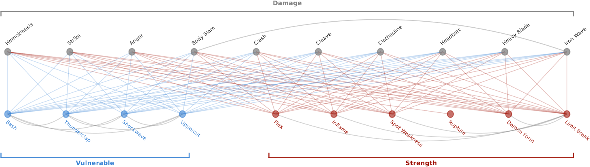

# Rule Synergy Analysis

A synergy is when two or more elements combine to produce an effect greater than the sum of their parts, and in card games, synergy between cards is a major source of strategic depth. Detecting these synergies requires not just understanding each card's individual effect, but reasoning about how those effects interact in complex, sometimes non-obvious ways, which makes it a demanding test of an LLM's understanding of game rules.

This project introduces a dataset of card synergies from [Slay the Spire](/projects/04-language-driven-play), covering every pairwise combination within one of the game's card sets, labeled as positive, negative, or no synergy. LLMs are prompted to classify each pair using only the cards' textual descriptions, without access to a playable version of the game or any simulated game state, making this a static reasoning task rather than a dynamic, gameplay-driven one.

Across every model tested, a consistent pattern emerges: LLMs are good at recognizing when two cards have no synergy, but struggle substantially with positive synergies and, even more so, negative ones. Newer, stronger models don't close this gap by much, suggesting that this kind of rule-interaction reasoning remains a genuinely hard, unsolved problem rather than one that scales away with general model improvements. The errors themselves fall into recognizable categories, including issues with timing and ordering of effects, misreading or subtly altering card descriptions, and reasoning about unrealistic or artificially constructed game states, all of which point toward specific directions for improving how LLMs reason about rule interactions.

This work, "Rule Synergy Analysis using LLMs: State of the Art and Implications" by Bahar Bateni, Benjamin Pratt, and Jim Whitehead, has received conditional acceptance at IEEE Transactions on Games (ToG) 2026 and is currently under revision.


<a class="m-1 btn btn-outline-secondary btn-md disabled" href="#" tabindex="-1" role="button" aria-disabled="true" style="pointer-events: none; opacity: 0.6;">Paper (Under Review)</a>


