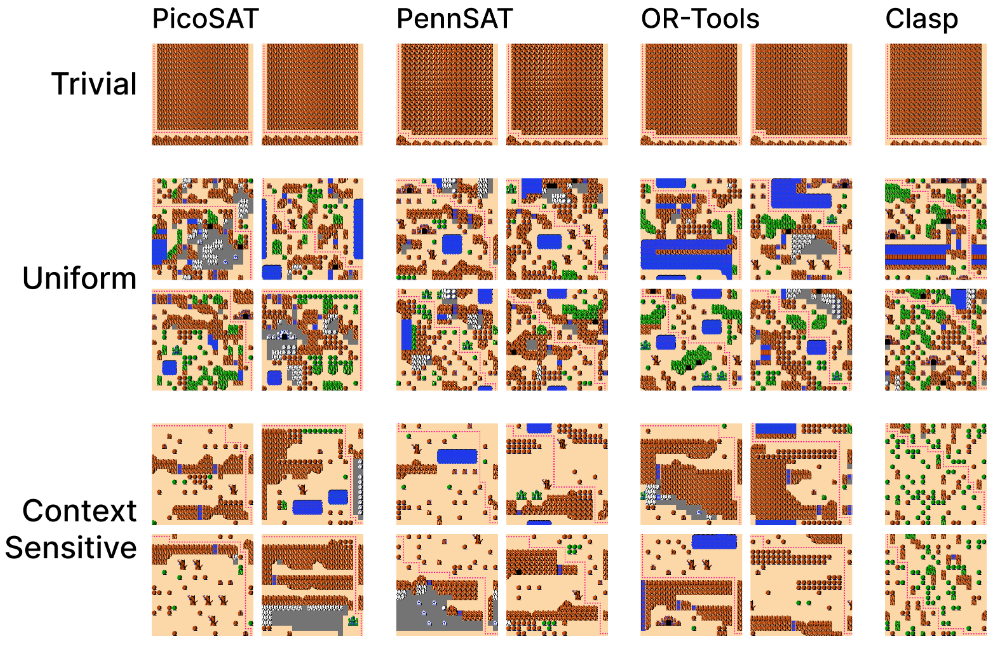

# You-Only-Randomize-Once

Modeling procedural content generation as a constraint satisfaction problem makes it possible to enforce hard local and global constraints, such as reachability, on the generated output. But a generator's perceived quality often depends on [statistical properties](/projects/06-context-sensitive-wfc) too, and such properties can't be expressed directly as a hard constraint on any single output. Methods that skip the general-purpose solver, like Gumin's original WaveFunctionCollapse (WFC), can shape these statistics but have limited constraint propagation and can't express non-local constraints.

You-Only-Randomize-Once (YORO) pre-rolling addresses this gap by crafting a decision variable ordering for a constraint solver that encodes the desired output statistics directly into the search process. Using a solver-based WFC as a testbed, this technique is shown to effectively control the statistics of generated tile-grid outputs across several off-the-shelf SAT solvers, all while still enforcing the generator's global constraints.

This work was presented in the paper "You-Only-Randomize-Once: Shaping Statistical Properties in Constraint-based PCG" by Jediah Katz, Bahar Bateni, and Adam M. Smith, published at FDG 2024. I contributed to this project but was not its main author or lead.




