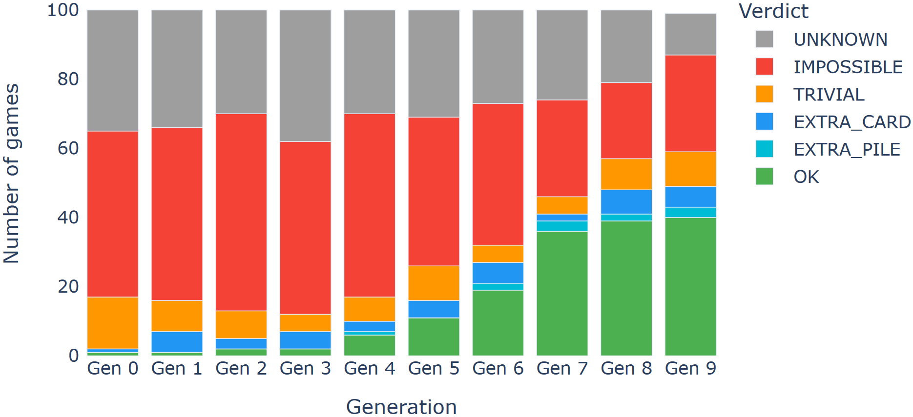
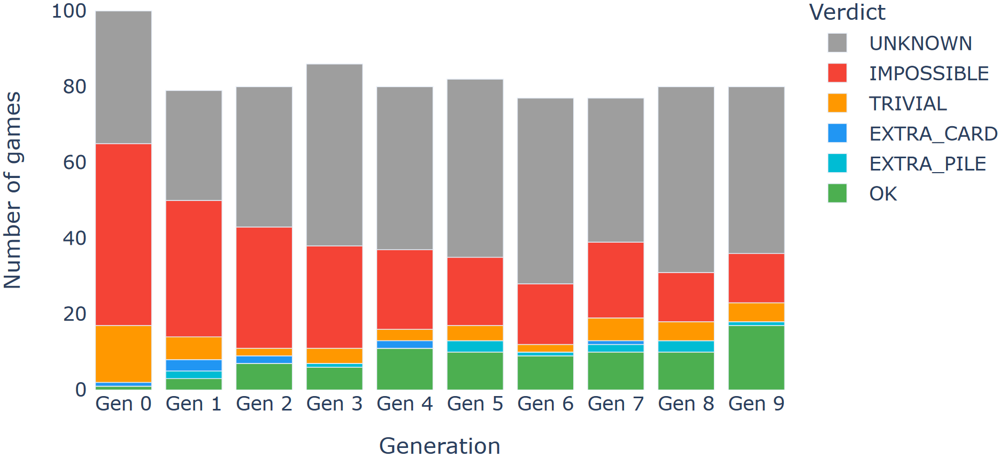
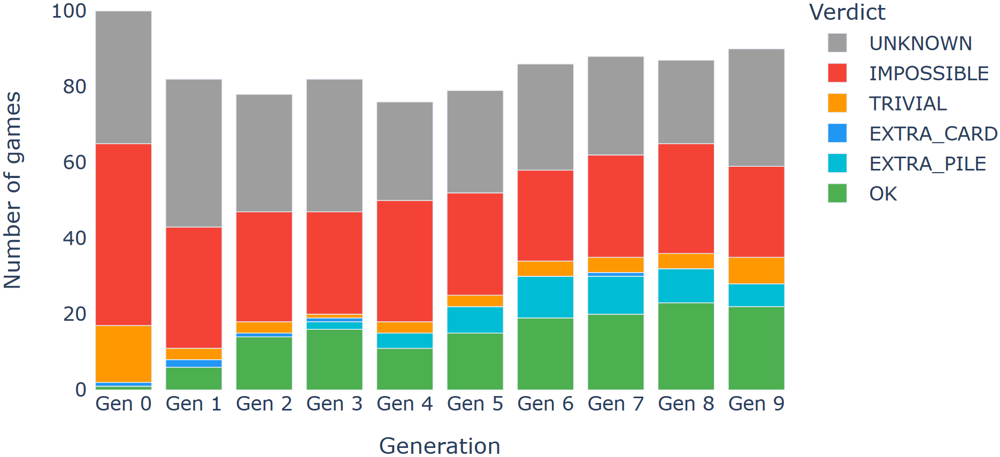
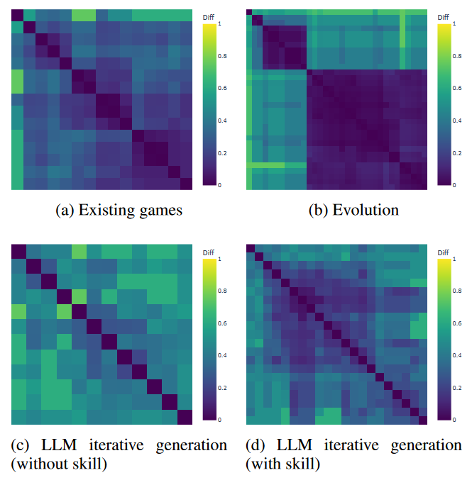

# Automated Iterative Design of Solitaire Games

Most automated game design approaches rely on evolutionary algorithms, trusting a "blind watchmaker" process of mutation and crossover to stumble onto good rules, with almost no design knowledge guiding which rules get chosen or removed. This project asks whether an LLM, given the same starting point, can instead act as an intentional designer, using its own understanding of how rules shape gameplay to guide the generation process.

  <figure style="margin: 0; text-align: center;">
    
    <figcaption style="font-size: 0.9em; color: #666;">(a) Evolution</figcaption>
  </figure>
  <figure style="margin: 0; text-align: center;">
    
    <figcaption style="font-size: 0.9em; color: #666;">(b) LLM iterative generation (without skill)</figcaption>
  </figure>
  <figure style="margin: 0; text-align: center;">
    
    <figcaption style="font-size: 0.9em; color: #666;">(c) LLM iterative generation (with skill)</figcaption>
  </figure>

Verdict distribution per generation.

The comparison is built on our [Solitaire GDL framework](/projects/9-solitaire-rule-understanding), which defines Solitaire variants in a custom Game Description Language and simulates them with general game-playing agents to extract evaluation metrics. Two generative processes start from the same 100 randomly generated Solitaire games. An evolutionary generator applies traditional mutation and crossover, guided by an internal fitness metric. An iterative LLM generator instead proposes a small, targeted change to each game every generation, based only on that game's own evaluation metrics, and refines its own understanding of game design over time by maintaining a self-learned skill file distilled from its past insights.

The two approaches trade off in different ways. Given enough generations, the evolutionary process finds more games that meet the acceptable-quality bar, but nearly all of them turn out to be close variations of just a few surviving root designs, converging on the same tight clusters of solutions. The LLM-designed games, by contrast, exhibit substantially higher diversity, since each game is improved independently rather than bred from a shared, narrowing population, and the self-learned skill file lets the LLM find good designs earlier and more deliberately than an LLM without it. Beyond automated design, these experiments serve as another test of how well LLMs can understand, apply and create structured rule systems.

This work, "Automated Iterative Design of Solitaire Games" by Bahar Bateni and Jim Whitehead, has been accepted to AIIDE 2026 and is not yet published.


<a class="m-1 btn btn-outline-secondary btn-md disabled" href="#" tabindex="-1" role="button" aria-disabled="true" style="pointer-events: none; opacity: 0.6;">Paper (Not Yet Published)</a>


