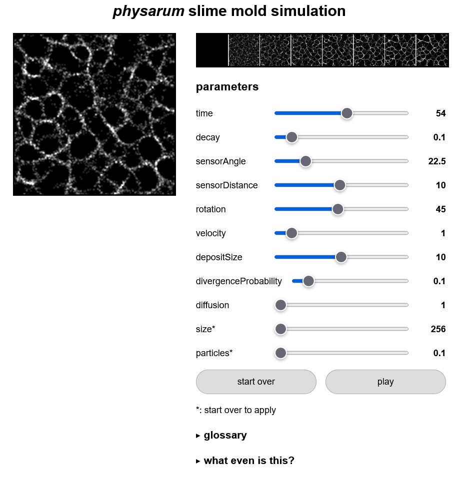

# Interactive Recording of Slime Mold Simulation

Slime mold (Physarum) simulation can be used to generate interesting self-emergant patterns. Since the patterns are self-emergant, controlling the simulation can be problematic. This project proposes the addition of a time-line feature to this simulation with the goal of improving user experience.



