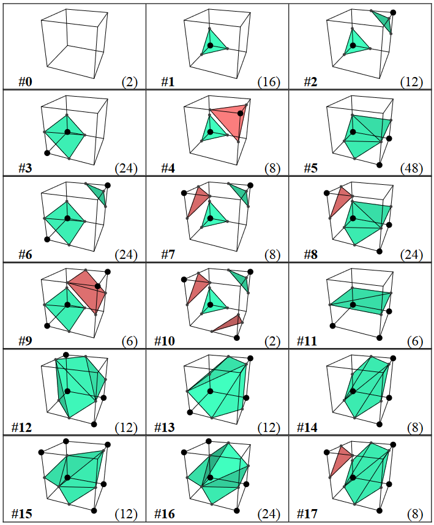

# Marching Cubes (Transvoxel Algorithm)

The Marching Cubes algorithm is a computational method used to generate a three-dimensional surface mesh from volumetric data. It operates on a grid of voxels and identifies the intersections between the grid cells and an isosuraface. By examining the value of voxels and their neighbors, the algorithm determines the conficuration of triangles needed to approximate the shape of the isosurface. These triangles form a mesh which can be renered and visualized, allowing for the representation of complex three-dimensional structures from volumetric data.

This project was implemented as for the Game Graphics Course at UCSC, Winter 2022, instructed by Eric Lengyl. I originally implemented this in the provided Game Engine, but I extracted this as an standalone implementation of marching cubes to share on GitHub.



