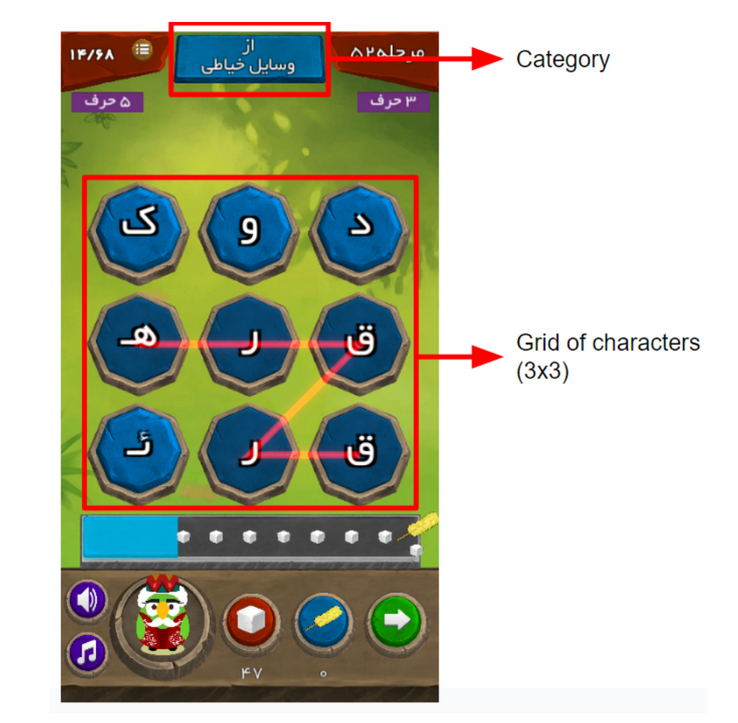

# ShekkarShekan

ShekkarShekan game is a 2D word-game developed for Android platforms and released in 2019. The game was developed in Unity, C#. In each level, the player can use the touchscreen interface to connect a set of consecutively adjacent cells on this grid to create a word. If the word is meaningful, the user gains xp points which count toward profile progression as well as in-game currency. Each level also has a specific theme. If the user finds all the available words related to this theme, the next level will be unlocked.

As one of the two developers of this project, I was responsible for tasks such as level design tool, automating the process of adding the level visuals and UI to the game, automated level generation, main game mechanics, scoring and save system. Part of the design process of the level designed tool (developed in C++/QT) is documented and can be found via the link below.



