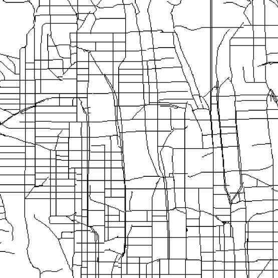

---
name: City Road Network Generation
tools: [Transformers, Generative Model, Tile-based Generation]
image: ../images/0_transformer_big.png
description: This project uses a transformer model to generate road networks by representing the network as black and white tiled images. The tiles then are extracted as tokens, which can be combined by the transformer model to generate new networks.
external_url:
--- 

# City Road Network Generation

This project aims to generate road networks by creating a 2D tile-based representation of these networks and using a Transformer model to generate new networks.

First, the map is rendered as a 2D image. Each pixel represents a different class of road (e.g. highway, street, empty, etc.). A tokenization process is used to represent each tile in this image by a single number. Two unidirectional transformer models are trained on this data, extracted from existing cities. The models are then used in a sliding window process to generate new road networks by predicting the next token give part of the map.

The results of this generation, as well as a comparison with the use of WaveFunctionCollapse (WFC) algorithm for the same task is provided in the paper "Structure and Coherence in City Road Network Generation" by Bahar Bateni and Jim Whitehead. The results show the abilities of transformers in understanding and generating complex structures in city networks.

<!-- 



 -->



