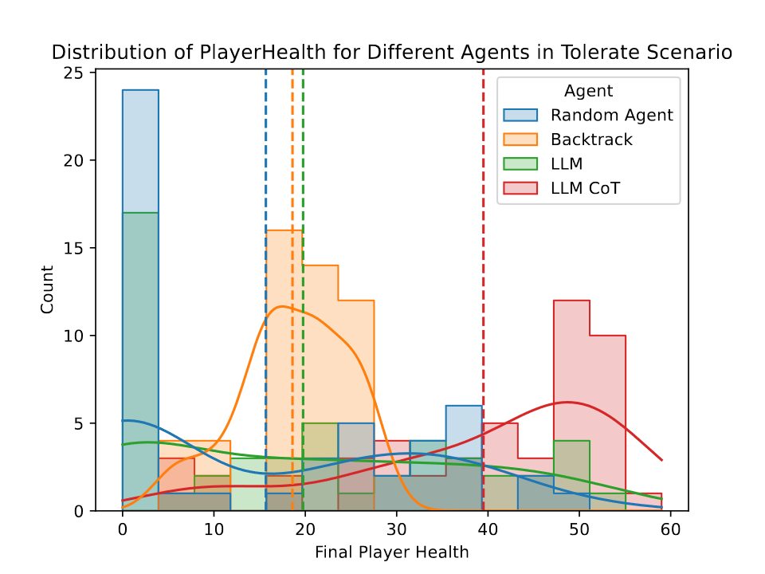

# Large-Driven Play

Evaluating procedurally generated game rules is difficult, since the impact of a rule change on balance and complexity isn't always obvious from the rule itself. One way to evaluate such content is to simulate play, which requires an agent that can both play the game and adapt to changes in its design, commonly known as a general game-playing agent.

This project explores whether Large Language Models can serve as general game-playing agents, without any game-specific training. The testbed is a simplified implementation of the card game Slay the Spire, chosen for the rich, interacting rules its cards create. The results suggest that while an LLM agent doesn't always choose the locally optimal move, it shows a notable capacity for long-term planning, all without specialized training for the task.

This work was presented in the paper "Language-Driven Play: Large Language Models as Game-Playing Agents in Slay the Spire" by Bahar Bateni and Jim Whitehead, published at FDG 2024.




