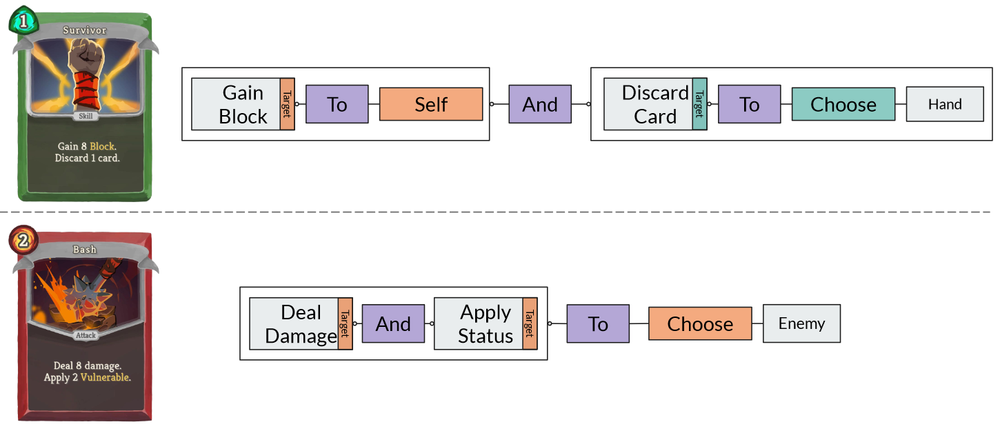
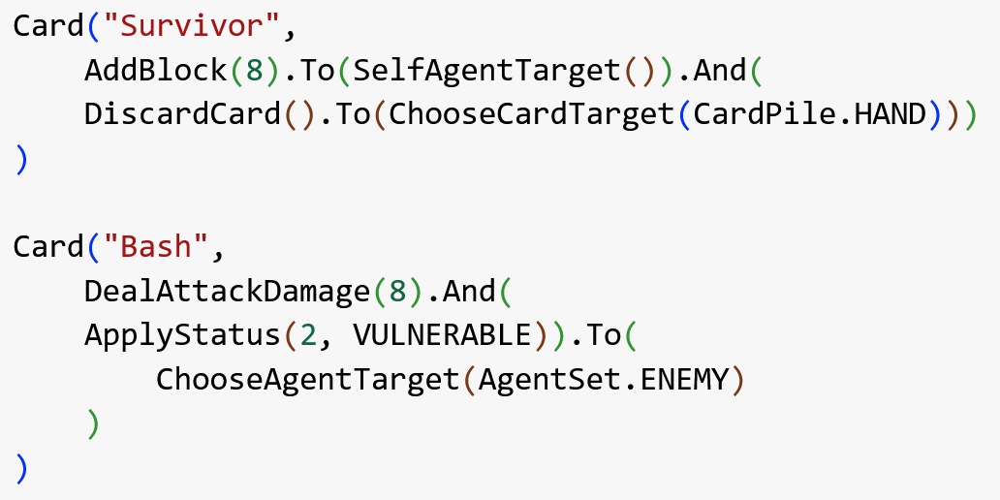

# MiniStS

Specialized testbeds are valuable tools in game AI and procedural content generation (PCG) research, giving controlled environments to develop and evaluate new algorithms. MiniStS is a research testbed modeled after the rogue-like card game Slay the Spire, built for studying game-playing AI and procedural generation of cards.

MiniStS's defining feature is its dynamic rule system. Cards in the game can modify the rules themselves, not just the game state. This creates a rich research setting, since a game-playing agent must reason about game design in order to use these rule changes to its advantage, and a card-generation agent must consider the space of rule combinations and synergies rather than a single fixed ruleset. MiniStS defines two main applications along these lines: generalized game-playing agents that adapt to dynamically changing rules, and card generation focused on exploring rule synergies.

This testbed is also the environment used in [Language-Driven Play](/projects/6-language-driven-play), where a Large Language Model is evaluated as a general game-playing agent within MiniStS.

This work was presented in the paper "MiniStS: A Testbed for Dynamic Rule Exploration" by Bahar Bateni and Jim Whitehead, presented at the 11th Experimental AI in Games Workshop (EXAG), 2024.




